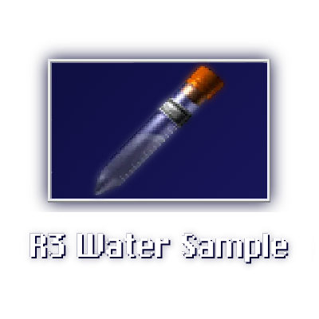

<h1 align="center">
    
     R3 Water Sample Puzzle 
    
    
</h1>

This is a nw version of water sample - a puzzle from a classic survivor horror game, created using [TMS.js](https://github.com/themitosan/TMS.js) and TS.

This project was created as a challenge - I'm still learning more about this _creepy_ language.

## Controls
- K, 0: Confirm,
- L, 6: Cancel,
- W, S, Arrow Up, Arrow Down: Select current row
- A, D, Arrow Left, Arrow Right: Move current row
- I, 8: (Endless Mode) Get random puzzle
- Esc, 0, Space: Pause menu

*This game also supports DualShock 4, DualSense, PlayStation 3, GameSir X2 USB controllers.*

## How to build
- Install Node.js 20.x
- Clone this repo
- Run `npm install`
- Run selected build file (Windows: .bat, Linux: .sh)

## External sources used to create this app
- [NW.js](https://nwjs.io/) - [GitHub page](https://github.com/nwjs/nw.js)
- [nw-builder](https://github.com/nwutils/nw-builder) from [nwutils](https://github.com/nwutils)
- [UglifyJS](https://github.com/mishoo/UglifyJS) created by [mishoo](https://github.com/mishoo)
- [SystemJS](https://github.com/systemjs/systemjs) created by [systemjs](https://github.com/systemjs)
- [clean-css](https://github.com/clean-css/clean-css) created by [clean-css](https://github.com/clean-css)
- [TMS.js](https://github.com/themitosan/TMS.js) created by [TheMitoSan](https://github.com/themitosan) <i>Hi!</i>
